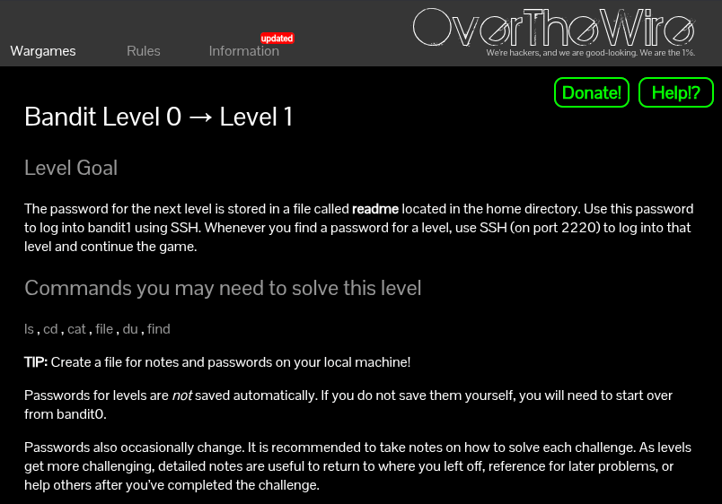

[Challenge Page](https://overthewire.org/wargames/bandit/bandit1.html)

### The goal:
We're logged in as `bandit0` from the previous level. Now we need to find the password for `bandit1`. According to the challenge, it's sitting in a file called `readme` in the home directory. Easy enough we just need to read it.

### Lil bit of the theory:
This level introduces you to basic Linux file navigation and reading. The commands the challenge hints at are ls, cd, cat, file, du, and find... but honestly, for this one, we only need two:

- `ls` — lists files and directories in your current location
- `cat` — prints the contents of a file to the terminal.

### My approach:

We just SSH'd into bandit0's home directory. The password is supposedly in a file called readme right there. So the plan is:

- Check what's in the home directory with ls

    ```
    ls
    ```
- Read the readme file with cat

    ```
    cat readme
    ```

That's it. Two commands.


### The password to login in to next level (level 1):

```
ZjLjTmM6FvvyRnrb2rfNWOZOTa6ip5If
```
