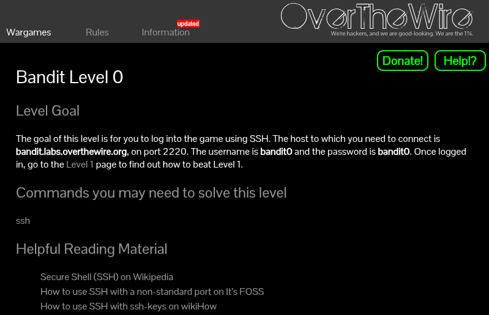
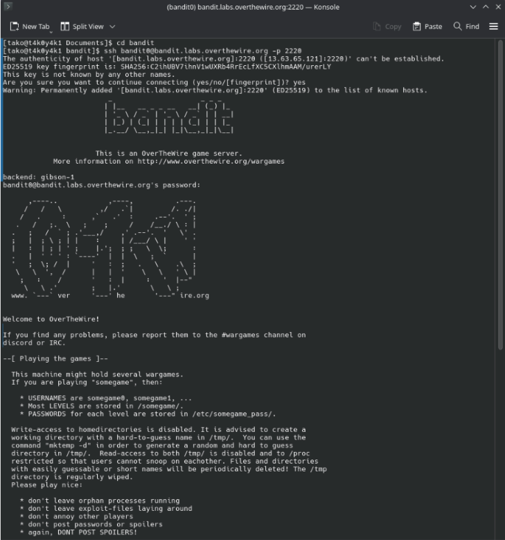

[Challenge Page](https://overthewire.org/wargames/bandit/bandit0.html)

### helpful reading material:
- [Secure Shell (SSH) on Wikipedia](https://en.wikipedia.org/wiki/Secure_Shell)
- [How to use SSH with a non-standard port on It’s FOSS](https://itsfoss.com/ssh-to-port/)
- [How to use SSH with ssh-keys on wikiHow](https://www.wikihow.com/Use-SSH)


### the goal here:
Pretty simple one to kick things off, all we need to do is log into the wargame server using SSH. Once you're in, you're done with Level 0 and can head over to Level 1.


### my approach:
Using the command:
```
ssh bandit0@bandit.labs.overthewire.org -p 2220
```
Let's connect to the server using the password provided `bandit0. Once the authentication is successful, we'll be greeted by the OverTheWire banner and a welcome message with some ground rules.

