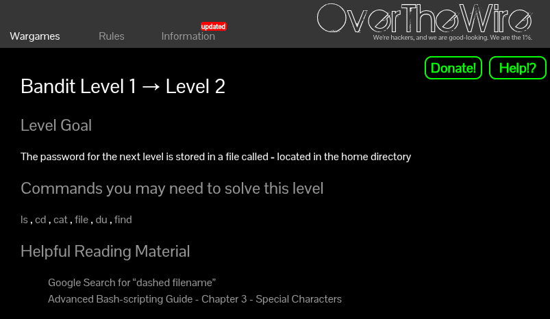
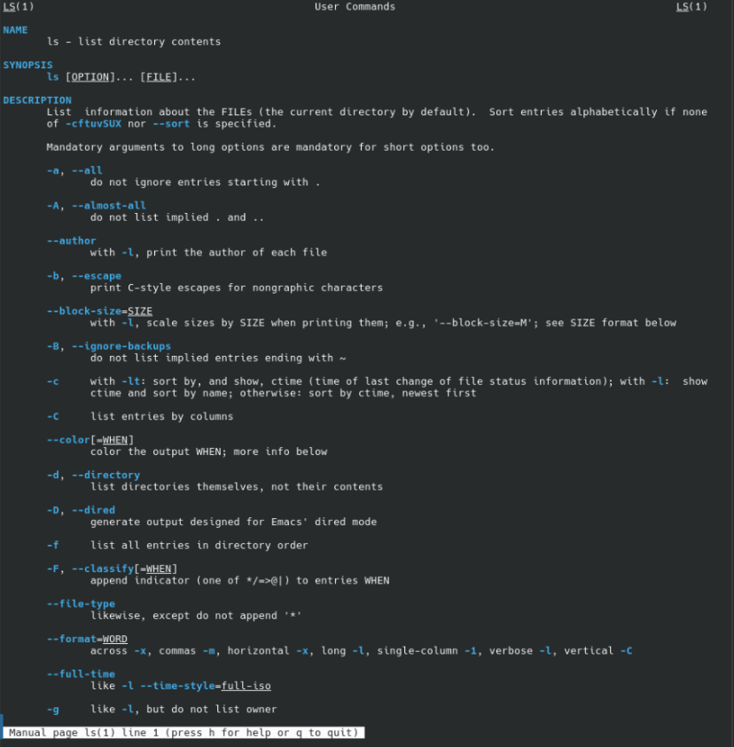
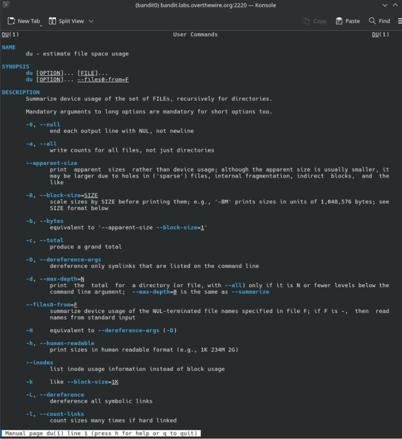
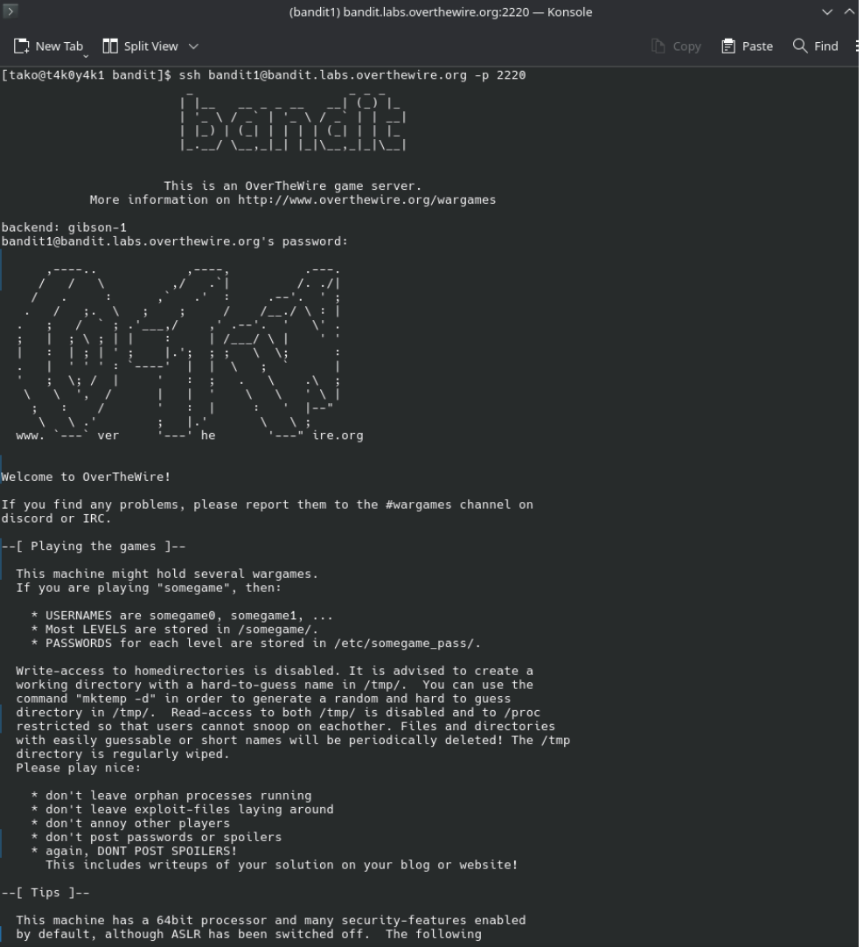
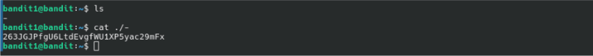

[Challenge Page](https://overthewire.org/wargames/bandit/bandit2.html)

### Helpful reading material:

- [Google Search for “dashed filename”](https://www.google.com/search?q=dashed+filename)
- [Advanced Bash-scripting Guide - Chapter 3 - Special Characters](https://linux.die.net/abs-guide/special-chars.html)

### The goal:
We're in as `bandit1` now. The password for `bandit2` is stored in a file called `-` (yes, just a dash) in the home directory. Sounds simple, but try running cat, and see what happens... (fyi it won't work T_T)

### A lil bit of theory:
- In Linux, a single dash `-` is conventionally used to mean standard input (stdin), so when you type `cat -`, the shell doesn't look for a file name `-`, it will just wait for you to type something.

- To actually read a file with a tricky name like this, you need to be more explicit about where the file is. That's where path prefixes come in.

Also worth knowing:
`man` pages are your best friend here. When you're not sure what a command does or what flags it supports, just run `man <command>`. In this level, checking `man ls` and `man du` helps you understand what tools are available and how they handle edge cases like this.






### My approach
I connected/logged in to the server as `bandit11` using the credentials found in the previous level:


Since `cat -` won't work, we need to tell the shell explicitly that `-` is a file path, not stdin. We can do this by prefixing it with `./—` which means "in the current directory". So instead of `cat -`, we use 
```
cat ./-
```




### The password to login into the next level (level 2):
```
263JGJPfgU6LtdEvgfWU1XP5yac29mFx
```