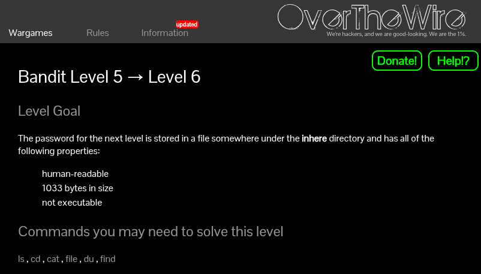
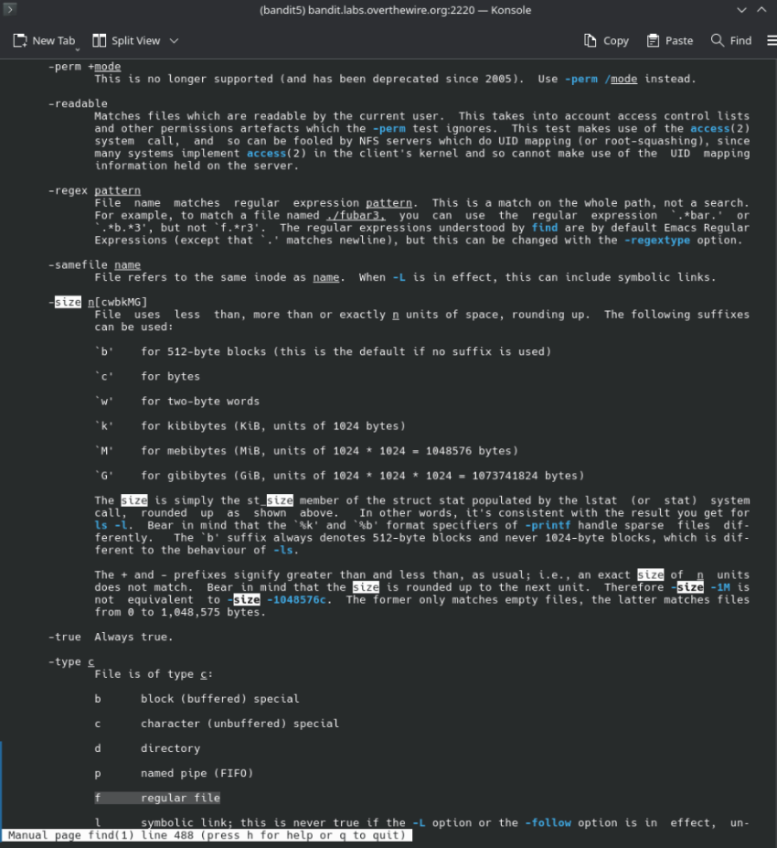
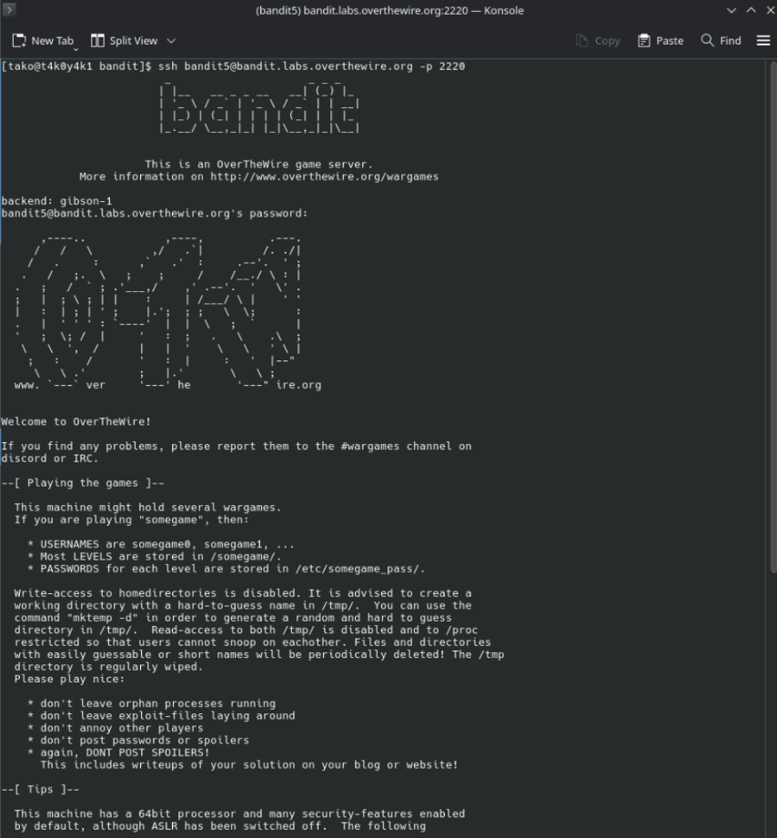
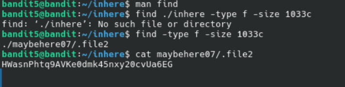

[Challenge Page]()

### the goal:
- login as `bandit5`
- The password is hiding somewhere under the `inhere directory`, but this time there's a whole buncha subdirectories in there. The challenge gives us three clues about the file:

    -  human-readable
    - 1033 bytes in size
    - not executable

The purpose of this challenge is to teach us, to use a command/tool to do the heavy lifting instead of manually digging through everything. We're going to let `find` do the heavy lifting.

### ze theory for nerds (and dummies :p) (i am one too, i love y'all)
The `find` command searches for files based on conditions you give it. Think of it as asking the filesystem a very specific question: 

"Hey, find me every file that matches ALL of these criteria."

The flags we care about here (as you'll see ahead):

- `-type f`: only looks for regular files (not directories, not symlinks, just files)

- `-size 1033c` — only files that are exactly 1033 bytes in size (`c` means bytes FYI) 

how did I figure out these flags? 
- `man find`: the manual page for `find`.



- Once inside the man page, press `/` to search and type `size` to jump straight to the relevant section. 

Luckily I also found the `-type` flag which shows the different flag used for different files to make the search/command narrower:

That's how we can find `-size` and its syntax, and I also stumbled across `-type` which narrowed things down even further.


### my approach

ssh'd into the server as `bandit5`, using the command (and the entering the password recovered in the previous level):

```
ssh bandit5@bandit.labs.overthewire.org -p 2220
```



As explained above as to how I found the flag and it's syntax to use with `find`, in my first attempt I tried running find from inside inhere with an explicit path:

```
find ./inhere -type f -size 1033c
```

so that just made run into an error...
makes sense cause the path I put was wrong

next, I just ran `find` from the current dir without the extra path:
```
find -type f -size 1033c
```

which then returned with the file and it's path, `./maybehere07/.file2`

so to read it:
```
cat maybehere07/.file2
```

and voila, there's the password!





### the password for the next level (level 6):
```
HWasnPhtq9AVKe0dmk45nxy20cvUa6EG
```
