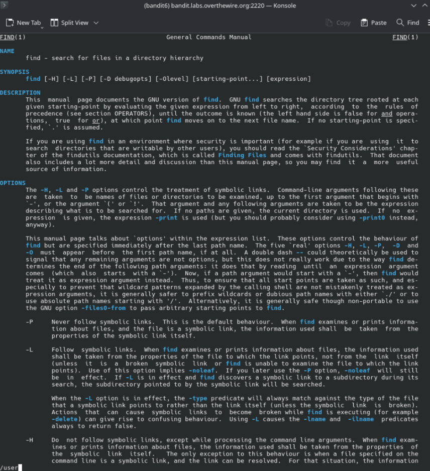
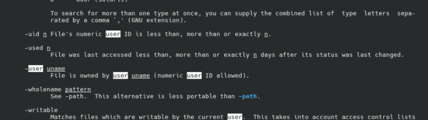

[Challenge Page](https://overthewire.org/wargames/bandit/bandit7.html)







2>/dev/null - hides all the "Permission denied" errors so you can see the result clearly


### the password for the next level (level 7):
```
morbNTDkSW6jIlUc0ymOdMaLnOlFVAaj
```


# Bandit Level 6 → Level 7

[Challenge Page](https://overthewire.org/wargames/bandit/bandit7.html)

## Level Goal

The password for the next level is stored somewhere on the server and has all of the following properties:

- owned by user `bandit7`
- owned by group `bandit6`
- 33 bytes in size

**Suggested commands:** `ls`, `cd`, `cat`, `file`, `du`, `find`, `grep`

## Solution

### 1. Log in to bandit6

```
ssh bandit6@bandit.labs.overthewire.org -p 2220
```

### 2. Check `man find` for the right predicates

Since we need to search the *entire filesystem* for a file matching specific ownership and size, `find` is the tool for the job. A quick look at the man page confirms the predicates we need:

- `-user uname` — file is owned by user `uname`
- `-group gname` — file is owned by group `gname` (same pattern as `-user`)
- `-size n` — file uses `n` units of space (`c` = bytes)

### 3. Explore the home directories first

Before diving into `find`, it's worth getting a feel for the filesystem layout:

```
bandit6@bandit:~$ ls -la
bandit6@bandit:~$ pwd
/home/bandit6
bandit6@bandit:~$ cd ..
bandit6@bandit:/home$ ls -la
```

This just confirms the standard Bandit home directory structure (`bandit0` through `bandit33`, plus other wargame home dirs like `behemoth*` and `drifter0`) — nothing owned by `bandit7`/`bandit6` jumps out here, so the file must be elsewhere on the system.

### 4. Search the whole filesystem with `find`

The goal explicitly says the file is "somewhere on the server," so we search from root (`/`):

```
bandit6@bandit:/home$ find / -user bandit -group bandit6 -size 33c
find: 'bandit' is not the name of a known user
```

First attempt fails — `bandit` isn't a valid user (it should be `bandit7`, per the challenge description). Fixing that:

```
bandit6@bandit:/home$ find / -user bandit7 -group bandit6 -size 33c
```

This works, but since we're searching from `/` as a low-privileged user, `find` tries to traverse directories we don't have permission to read (`/etc/credstore`, `/run/user/*`, `/etc/polkit-1/rules.d`, etc.), producing a wall of `Permission denied` errors that bury the actual result.

### 5. Clean up the output

Redirecting stderr to `/dev/null` suppresses all the "Permission denied" noise, leaving only the actual match:

```
bandit6@bandit:/home$ find / -user bandit7 -group bandit6 -size 33c 2>/dev/null
/var/lib/dpkg/info/bandit7.password
```

`2>/dev/null` works because file descriptor `2` is stderr — this discards every error message `find` would otherwise print for directories it can't access, so only real matches print to stdout.

### 6. Read the file

```
bandit6@bandit:/home$ cat /var/lib/dpkg/info/bandit7.password
morbNTDkSW6jIlUc0ymOdMaLnOlFVAaj
```

## Password for Level 7

```
morbNTDkSW6jIlUc0ymOdMaLnOlFVAaj
```


