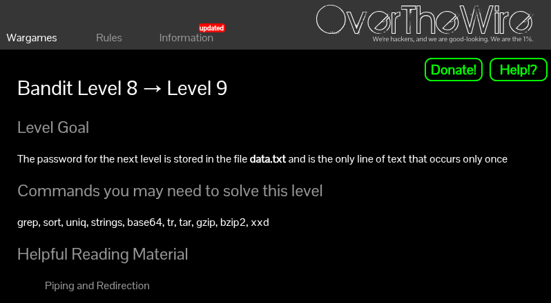
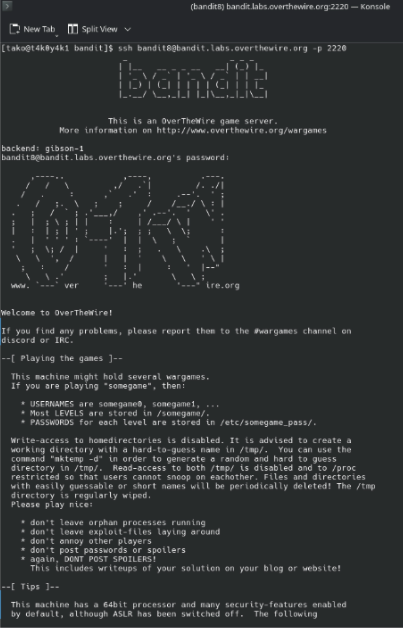
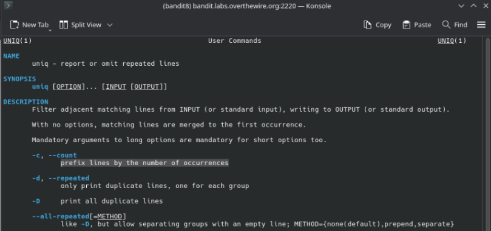
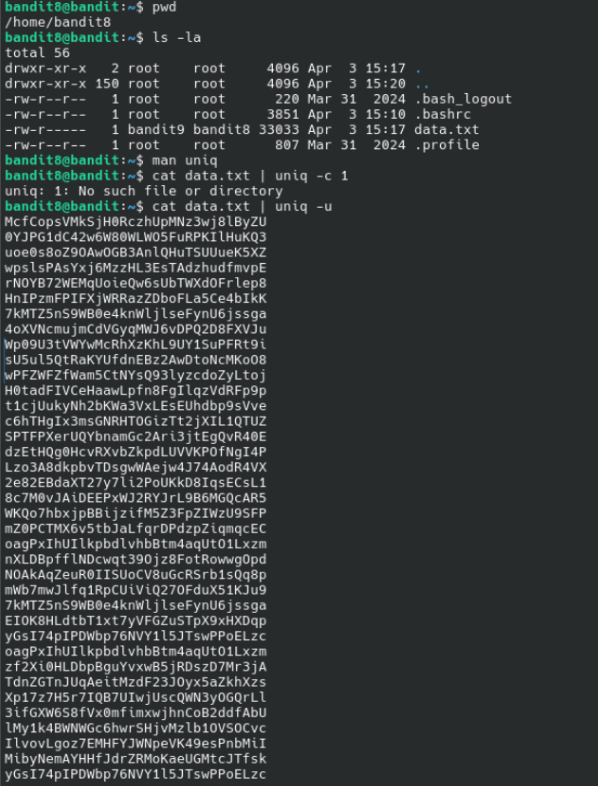
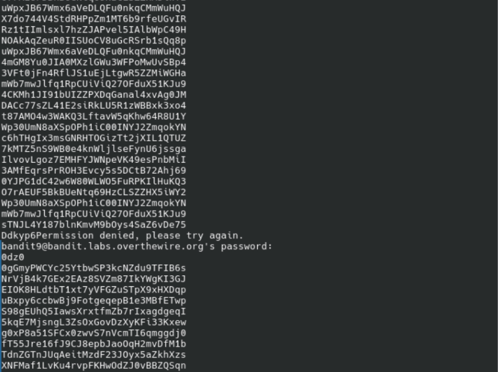
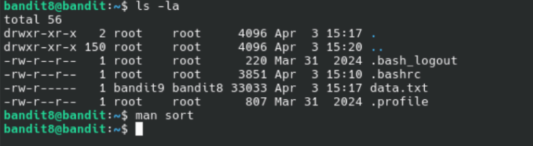
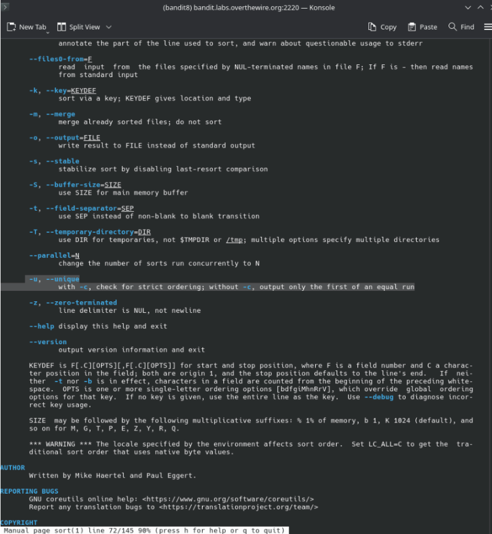
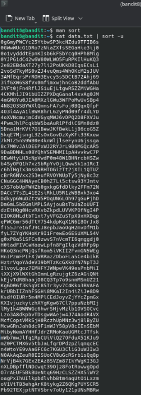
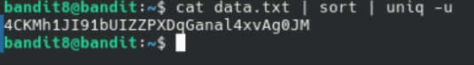

Helpful Reading Material:

[Piping and Redirection](https://ryanstutorials.net/linuxtutorial/piping.php)







I tried accessing the next level but, I think it was too long or I made some kinda mistake:











```
4CKMh1JI91bUIZZPXDqGanal4xvAg0JM
```

<!--Explain why exactly this command worked and now the above one>