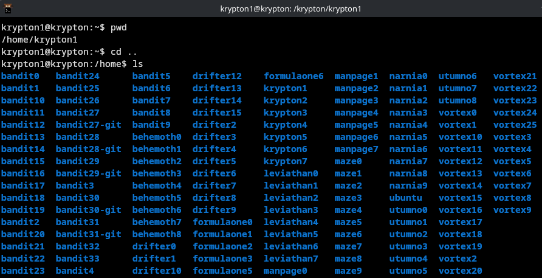
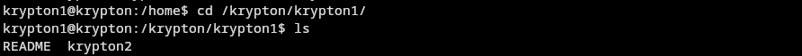
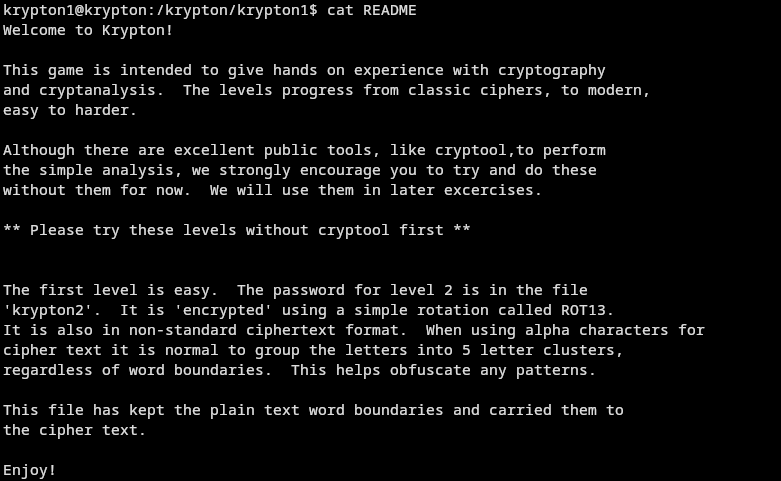
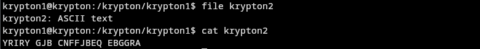
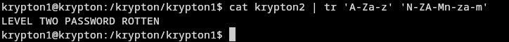

# detailed writeup remaining









<!--read up about alpha characters in ROT13, add into this -->

<!--explain why I used tr and this specific command -->

'''
tr 'A-Za-z' 'N-ZA-Mn-za-m'
'''




the password for the next level is:
```
ROTTEN
```
