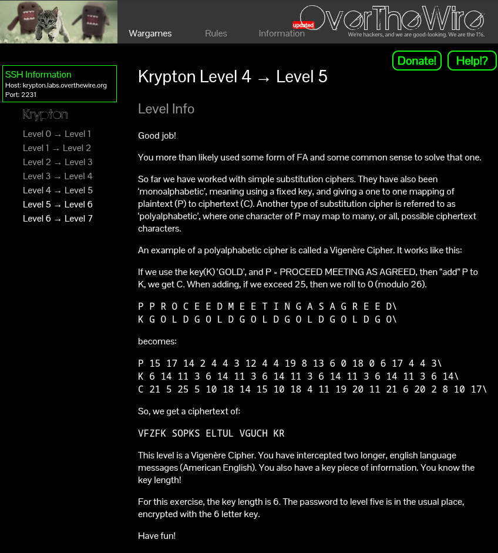
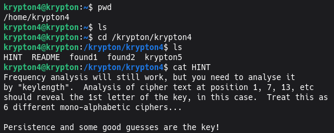
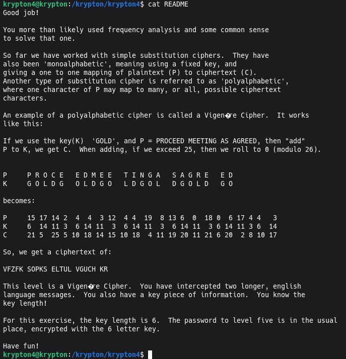
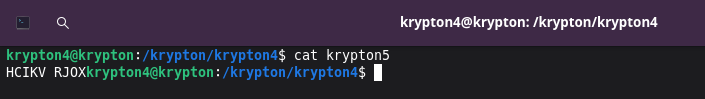
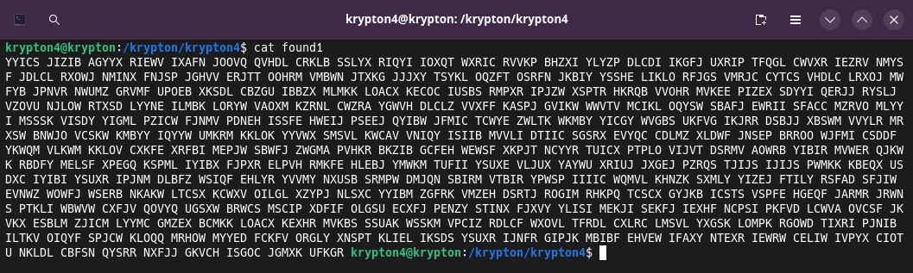
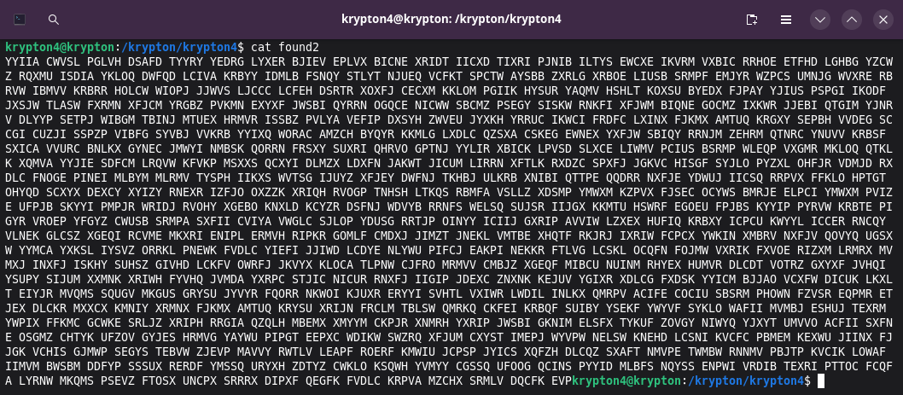
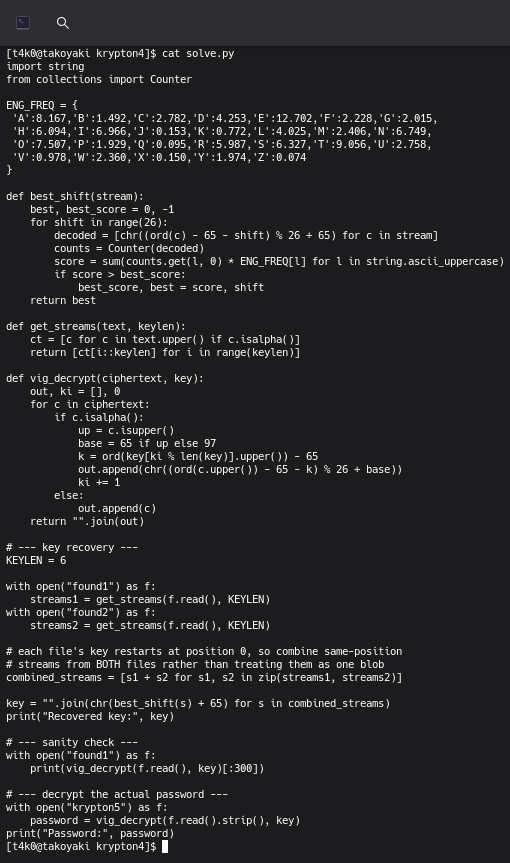
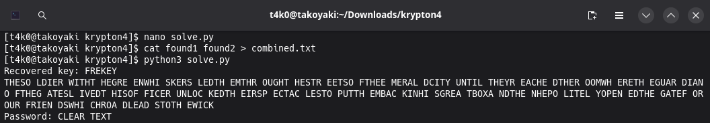

```
HCIKV RJOX
```


```
YYICS JIZIB AGYYX RIEWV IXAFN JOOVQ QVHDL CRKLB SSLYX RIQYI IOXQT WXRIC RVVKP BHZXI YLYZP DLCDI IKGFJ UXRIP TFQGL CWVXR IEZRV NMYSF JDLCL RXOWJ NMINX FNJSP JGHVV ERJTT OOHRM VMBWN JTXKG JJJXY TSYKL OQZFT OSRFN JKBIY YSSHE LIKLO RFJGS VMRJC CYTCS VHDLC LRXOJ MWFYB JPNVR NWUMZ GRVMF UPOEB XKSDL CBZGU IBBZX MLMKK LOACX KECOC IUSBS RMPXR IPJZW XSPTR HKRQB VVOHR MVKEE PIZEX SDYYI QERJJ RYSLJ VZOVU NJLOW RTXSD LYYNE ILMBK LORYW VAOXM KZRNL CWZRA YGWVH DLCLZ VVXFF KASPJ GVIKW WWVTV MCIKL OQYSW SBAFJ EWRII SFACC MZRVO MLYYI MSSSK VISDY YIGML PZICW FJNMV PDNEH ISSFE HWEIJ PSEEJ QYIBW JFMIC TCWYE ZWLTK WKMBY YICGY WVGBS UKFVG IKJRR DSBJJ XBSWM VVYLR MRXSW BNWJO VCSKW KMBYY IQYYW UMKRM KKLOK YYVWX SMSVL KWCAV VNIQY ISIIB MVVLI DTIIC SGSRX EVYQC CDLMZ XLDWF JNSEP BRROO WJFMI CSDDF YKWQM VLKWM KKLOV CXKFE XRFBI MEPJW SBWFJ ZWGMA PVHKR BKZIB GCFEH WEWSF XKPJT NCYYR TUICX PTPLO VIJVT DSRMV AOWRB YIBIR MVWER QJKWK RBDFY MELSF XPEGQ KSPML IYIBX FJPXR ELPVH RMKFE HLEBJ YMWKM TUFII YSUXE VLJUX YAYWU XRIUJ JXGEJ PZRQS TJIJS IJIJS PWMKK KBEQX USDXC IYIBI YSUXR IPJNM DLBFZ WSIQF EHLYR YVVMY NXUSB SRMPW DMJQN SBIRM VTBIR YPWSP IIIIC WQMVL KHNZK SXMLY YIZEJ FTILY RSFAD SFJIW EVNWZ WOWFJ WSERB NKAKW LTCSX KCWXV OILGL XZYPJ NLSXC YYIBM ZGFRK VMZEH DSRTJ ROGIM RHKPQ TCSCX GYJKB ICSTS VSPFE HGEQF JARMR JRWNS PTKLI WBWVW CXFJV QOVYQ UGSXW BRWCS MSCIP XDFIF OLGSU ECXFJ PENZY STINX FJXVY YLISI MEKJI SEKFJ IEXHF NCPSI PKFVD LCWVA OVCSF JKVKX ESBLM ZJICM LYYMC GMZEX BCMKK LOACX KEXHR MVKBS SSUAK WSSKM VPCIZ RDLCF WXOVL TFRDL CXLRC LMSVL YXGSK LOMPK RGOWD TIXRI PJNIB ILTKV OIQYF SPJCW KLOQQ MRHOW MYYED FCKFV ORGLY XNSPT KLIEL IKSDS YSUXR IJNFR GIPJK MBIBF EHVEW IFAXY NTEXR IEWRW CELIW IVPYX CIOTU NKLDL CBFSN QYSRR NXFJJ GKVCH ISGOC JGMXK UFKGR
```


```
YYIIA CWVSL PGLVH DSAFD TYYRY YEDRG LYXER BJIEV EPLVX BICNE XRIDT IICXD TIXRI PJNIB ILTYS EWCXE IKVRM VXBIC RRHOE ETFHD LGHBG YZCWZ RQXMU ISDIA YKLOQ DWFQD LCIVA KRBYY IDMLB FSNQY STLYT NJUEQ VCFKT SPCTW AYSBB ZXRLG XRBOE LIUSB SRMPF EMJYR WZPCS UMNJG WVXRE RBRVW IBMVV KRBRR HOLCW WIOPJ JJWVS LJCCC LCFEH DSRTR XOXFJ CECXM KKLOM PGIIK HYSUR YAQMV HSHLT KOXSU BYEDX FJPAY YJIUS PSPGI IKODF JXSJW TLASW FXRMN XFJCM YRGBZ PVKMN EXYXF JWSBI QYRRN OGQCE NICWW SBCMZ PSEGY SISKW RNKFI XFJWM BIQNE GOCMZ IXKWR JJEBI QTGIM YJNRV DLYYP SETPJ WIBGM TBINJ MTUEX HRMVR ISSBZ PVLYA VEFIP DXSYH ZWVEU JYXKH YRRUC IKWCI FRDFC LXINX FJKMX AMTUQ KRGXY SEPBH VVDEG SCCGI CUZJI SSPZP VIBFG SYVBJ VVKRB YYIXQ WORAC AMZCH BYQYR KKMLG LXDLC QZSXA CSKEG EWNEX YXFJW SBIQY RRNJM ZEHRM QTNRC YNUVV KRBSF SXICA VVURC BNLKX GYNEC JMWYI NMBSK QORRN FRSXY SUXRI QHRVO GPTNJ YYLIR XBICK LPVSD SLXCE LIWMV PCIUS BSRMP WLEQP VXGMR MKLOQ QTKLK XQMVA YYJIE SDFCM LRQVW KFVKP MSXXS QCXYI DLMZX LDXFN JAKWT JICUM LIRRN XFTLK RXDZC SPXFJ JGKVC HISGF SYJLO PYZXL OHFJR VDMJD RXDLC FNOGE PINEI MLBYM MLRMV TYSPH IIKXS WVTSG IJUYZ XFJEY DWFNJ TKHBJ ULKRB XNIBI QTTPE QQDRR NXFJE YDWUJ IICSQ RRPVX FFKLO HPTGT OHYQD SCXYX DEXCY XYIZY RNEXR IZFJO OXZZK XRIQH RVOGP TNHSH LTKQS RBMFA VSLLZ XDSMP YMWXM KZPVX FJSEC OCYWS BMRJE ELPCI YMWXM PVIZE UFPJB SKYYI PMPJR WRIDJ RVOHY XGEBO KNXLD KCYZR DSFNJ WDVYB RRNFS WELSQ SUJSR IIJGX KKMTU HSWRF EGOEU FPJBS KYYIP PYRVW KRBTE PIGYR VROEP YFGYZ CWUSB SRMPA SXFII CVIYA VWGLC SJLOP YDUSG RRTJP OINYY ICIIJ GXRIP AVVIW LZXEX HUFIQ KRBXY ICPCU KWYYL ICCER RNCQY VLNEK GLCSZ XGEQI RCVME MKXRI ENIPL ERMVH RIPKR GOMLF CMDXJ JIMZT JNEKL VMTBE XHQTF RKJRJ IXRIW FCPCX YWKIN XMBRV NXFJV QOVYQ UGSXW YYMCA YXKSL IYSVZ ORRKL PNEWK FVDLC YIEFI JJIWD LCDYE NLYWU PIFCJ EAKPI NEKKR FTLVG LCSKL OCQFN FOJMW VXRIK FXVOE RIZXM LRMRX MVMXJ INXFJ ISKHY SUHSZ GIVHD LCKFV OWRFJ JKVYX KLOCA TLPNW CJFRO MRMVV CMBJZ XGEQF MIBCU NUINM RHYEX HUMVR DLCDT VOTRZ GXYXF JVHQI YSUPY SIJUM XXMNK XRIWH FYVHQ JVMDA YXRPC STJIC NICUR RNXFJ IIGIP JDEXC ZNXNK KEJUV YGIXR XDLCG FXDSK YYICM BJJAO VCXFW DICUK LKXLT EIYJR MVQMS SQUGV MKGUS GRYSU JYVYR FQORR NKWOI KJUXR ERYYI SVHTL VXIWR LWDIL INLKX QMRPV ACIFE COCIU SBSRM PHOWN FZVSR EQPMR ETJEX DLCKR MXXCX KMNIY XRMNX FJKMX AMTUQ KRYSU XRIJN FRCLM TBLSW QMRKQ CKFEI KRBQF SUIBY YSEKF YWYVF SYKLO WAFII MVMBJ ESHUJ TEXRM YWPIX FFKMC GCWKE SRLJZ XRIPH RRGIA QZQLH MBEMX XMYYM CKPJR XNMRH YXRIP JWSBI GKNIM ELSFX TYKUF ZOVGY NIWYQ YJXYT UMVVO ACFII SXFNE OSGMZ CHTYK UFZOV GYJES HRMVG YAYWU PIPGT EEPXC WDIKW SWZRQ XFJUM CXYST IMEPJ WYVPW NELSW KNEHD LCSNI KVCFC PBMEM KEXWU JIINX FJJGK VCHIS GJMWP SEGYS TEBVW ZJEVP MAVVY RWTLV LEAPF ROERF KMWIU JCPSP JYICS XQFZH DLCQZ SXAFT NMVPE TWMBW RNNMV PBJTP KVCIK LOWAF IIMVM BWSBM DDFYP SSSUX RERDF YMSSQ URYXH ZDTYZ CWKLO KSQWH YVMYY CGSSQ UFOOG QCINS PYYID MLBFS NQYSS ENPWI VRDIB TEXRI PTTOC FCQFA LYRNW MKQMS PSEVZ FTOSX UNCPX SRRRX DIPXF QEGFK FVDLC KRPVA MZCHX SRMLV DQCFK EVP
```



```py
import string
from collections import Counter

ENG_FREQ = {
 'A':8.167,'B':1.492,'C':2.782,'D':4.253,'E':12.702,'F':2.228,'G':2.015,
 'H':6.094,'I':6.966,'J':0.153,'K':0.772,'L':4.025,'M':2.406,'N':6.749,
 'O':7.507,'P':1.929,'Q':0.095,'R':5.987,'S':6.327,'T':9.056,'U':2.758,
 'V':0.978,'W':2.360,'X':0.150,'Y':1.974,'Z':0.074
}

def best_shift(stream):
    best, best_score = 0, -1
    for shift in range(26):
        decoded = [chr((ord(c) - 65 - shift) % 26 + 65) for c in stream]
        counts = Counter(decoded)
        score = sum(counts.get(l, 0) * ENG_FREQ[l] for l in string.ascii_uppercase)
        if score > best_score:
            best_score, best = score, shift
    return best

def get_streams(text, keylen):
    ct = [c for c in text.upper() if c.isalpha()]
    return [ct[i::keylen] for i in range(keylen)]

def vig_decrypt(ciphertext, key):
    out, ki = [], 0
    for c in ciphertext:
        if c.isalpha():
            up = c.isupper()
            base = 65 if up else 97
            k = ord(key[ki % len(key)].upper()) - 65
            out.append(chr((ord(c.upper()) - 65 - k) % 26 + base))
            ki += 1
        else:
            out.append(c)
    return "".join(out)

# --- key recovery ---
KEYLEN = 6

with open("found1") as f:
    streams1 = get_streams(f.read(), KEYLEN)
with open("found2") as f:
    streams2 = get_streams(f.read(), KEYLEN)

# each file's key restarts at position 0, so combine same-position
# streams from BOTH files rather than treating them as one blob
combined_streams = [s1 + s2 for s1, s2 in zip(streams1, streams2)]

key = "".join(chr(best_shift(s) + 65) for s in combined_streams)
print("Recovered key:", key)

# --- sanity check ---
with open("found1") as f:
    print(vig_decrypt(f.read(), key)[:300])

# --- decrypt the actual password ---
with open("krypton5") as f:
    password = vig_decrypt(f.read().strip(), key)
print("Password:", password)
```



```
CLEARTEXT
```